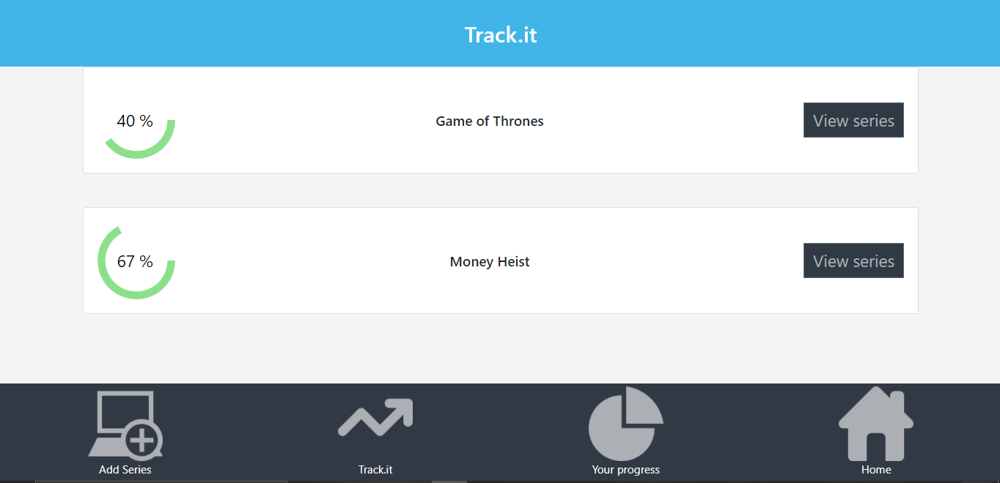
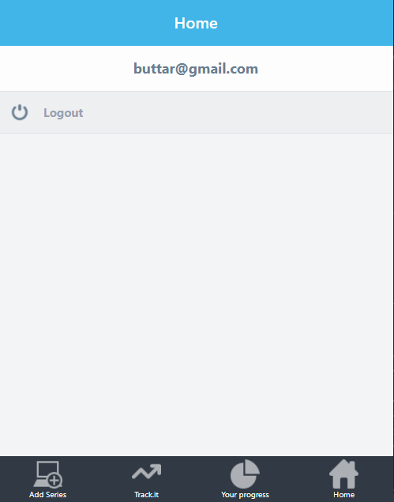
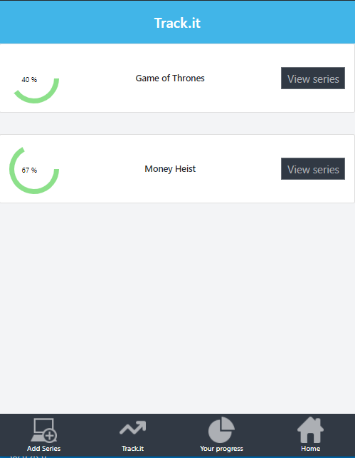

# Series Tracker

In this app you can keep track of your favourite movie series, based on a goal you set. Built with Ruby on Rails, React, Bootstrap and Redux.

This project was bootstrapped with [Create React App](https://github.com/facebook/create-react-app).

## snapshot

## Link to API Repository
[Series Tracker API](https://github.com/evansinho/series_tracker_api)

## live demo
[Series Tracker App](https://evanson-series-tracker.netlify.app/)

[Series Tracker API](https://immense-dusk-13622.herokuapp.com/)

## Nice to have requirements

- Implement proper user authentication from the front-end to the server
- Create a user table in your database, so that a given user could only access the measurements they entered
- Create an admin panel to create / update / delete things to measure
- Make the app responsive, creating both tablet and desktop versions, following design guidelines
- You could implement transitions to make user experience better
- You can implement the progress page with data charts

## What it does?
- When the App is executed, you will be able to:

 - Login or signup as a new user;
 - Add series you are seeing with your episode and season goal, together with the amount you already completed;
 - Get a list of all series you are currently seeing;
 - View a single series details, edit or delete it;
 - View your overall progress with a Pie Chart.

## Built with
- React
- Ruby on Rails
- JavaScript/ES6
- React Hooks
- React Router
- Redux
- Boostrap
- React Redux
- Netlify
- Heroku

### Prerequisites

- Node
- Npm

### Setup

- git clone `https://github.com/evansinho/series_tracker_app`
- cd Series_tracker_app
- run npm install
- run npm run start

## Authors

👤 **Evanson Igiri**

- [Portfolio](https://evansinho.github.io/Evanson-igiri/)
- [Twitter](https://twitter.com/iamsinho1304)
- [Linkedin](LinkedIn.com/in/evanson-igiri)
- [Email](mailto:igiri.evanson@gmail.com)

## 🤝 Contributing

Contributions, issues and feature requests are welcome!

Feel free to check the [issues page](https://github.com/evansinho/series_tracker_app/issues).

## Show your support

Give a ⭐️ if you like this project!

## Acknowledgments

- MIcroverse
- Microverse TSE's

## 📝 License

This project is [Apache](lic.url) licensed.